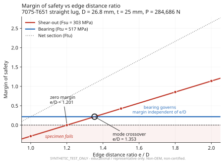
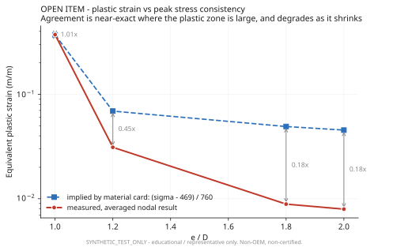

# AeroFrame-DT

**Full stress substantiation of one critical aircraft part, carried from load basis to inspection
interval — with every assumption tested.**

A forward pylon-to-wingbox attachment fitting (AF-DT-1000) on an MD-11-class aircraft, analysed the
way a stress engineer would: hand methods first, FE to verify the assumptions behind them, published
test data to correlate, and a formal stress report at the end — supported by a reproducible Python
toolchain and a revision-aware digital thread.

> **Claim boundary:** educational and portfolio-focused; non-OEM; non-certified. Geometry and load
> case are `SYNTHETIC_TEST_ONLY`; the damage-tolerance spectrum is `SYNTHETIC_SPECTRUM`; the cost
> rates are `ASSUMED_COST_BASIS`. **Material allowables are real**, with page-level citation. No
> example load, dimension, allowable, spectrum, or result may be represented as aircraft design data.

**Start here: [`docs/STRESS_REPORT_AF-DT-1000.md`](docs/STRESS_REPORT_AF-DT-1000.md)**
**Lost? [`docs/README.md`](docs/README.md) indexes all 36 documents with reading paths.**

---

## Result

| | |
|---|---|
| **Governing margin** | **`MS = +0.156`** — passes |
| At Ekvall worst-case method scatter | `-0.028` — negative, and stated rather than buried |
| Failure mode | combined bearing / transverse at the lug bore |
| Pin | high-strength steel mandatory, bending governs at 780 MPa |
| Damage tolerance | critical crack **3.07 mm**, NDI at 4,500-flight intervals |
| First natural frequency | **1197 Hz** — inside the plausible blade-passing band |
| **Open finding (F20)** | the allowables band cited is not the plate the part can be cut from |
| **Open finding (F21)** | the allowables are cited from a **cancelled handbook** |

### The margin moved by a factor of 9, then came halfway back

| Stage | MS | What changed |
|---|---|---|
| Initial hand analysis | +0.710 | — |
| Thick-lug correction, elastic | +0.165 | the method assumes uniform bearing; at `t/D = 1.25` it isn't |
| Real A-basis allowables | +0.078 | the assumed `Ftu` was 9% optimistic |
| **Elastic-plastic contact measurement** | **+0.156** | yielding redistributes the bearing peak |

The first two corrections refined nothing — each removed an assumption that did not hold. **The most
useful thing this project produced was finding out its own headline number was wrong.** The third
is the only correction that moved the margin favourably, and it did so by replacing a conservative
bound with a measurement.

---

## What's distinctive

**Predictions were committed to git before the runs that tested them.** Eight in the FE correlation
work, plus two more: that the analytical 2133 Hz first mode would prove **high** (it did, by 44%),
and that a rectangular beam section might be entered 90° out and would then read **exactly 4× the
correct deflection** (it did). **The failures are still in the repository**, because removing them
would misrepresent how the conclusions were reached.

**A measurement designed around a divergent quantity.** Contact pressure at a clearance-fit bore is
mesh-singular — it rose 134% across a three-point convergence study and never settled. The needed
quantity was extracted as a *ratio* of two runs sharing that singularity, which converged to 8.2%.
Predicted to work, then demonstrated to work — and the same construction carried cleanly into the
elastic-plastic run.
[`F7`](docs/F7_CONTACT_THICK_LUG.md) · [`F16`](docs/F16_ELASTIC_PLASTIC_CONTACT.md)

**The project audited its own sources and found them cancelled.** Every material allowable is cited
from MIL-HDBK-5J — superseded by MMPDS, and removed from the 14 CFR 25.613 compliance path. The
values are not in question; the currency of the citation is. That audit also reopened a requirement
previously closed as permanently blocked, because "no S-N data exists" was a statement about a 2003
document. [`F21`](docs/F21_ALLOWABLES_GOVERNANCE.md)

**A cost analysis that found a materials problem instead of a price.** The billet is set by the part
envelope, 16.000 × 6.000 × 9.000 in — so the part cannot be cut from stock thinner than **6.000 in**,
while the allowables come from the **2.001–2.500 in** plate band. Buy-to-fly is **5.36**, and
removing finished mass without shrinking the envelope costs nothing to make.
[`F20`](docs/F20_COST_TRADE.md)

**A composite trade answered from the project's own measurements.** Should this be carbon? No — and
not for generic reasons. F16 measured the margin nearly doubling *because the aluminium yielded and
redistributed the bearing peak*. A laminate has no such mechanism, and at `t/D = 1.25` the load goes
straight through the thickness into the matrix-dominated direction.
[`F22`](docs/F22_COMPOSITE_TRADE.md)

**A configuration-management tool tested against a rework cycle that actually happened.** The
evidence graph was registered as it stood at load revision B, then the real correction was applied —
a lug-axis mapping error where 30.96° had been measured from the wrong reference. The graph flagged
30 artifacts stale, reproducing a blast radius that had been worked out by hand. The one place it
over-flags is named and explained rather than hidden. Registering a later analysis then exposed a
defect in the graph's own cycle check, which hung instead of reporting; that is fixed, tested, and
written up. [`F14`](docs/F14_DIGITAL_THREAD.md)

**Tolerances derived from margin sensitivity, then stacked back onto the margin.** Every GD&T callout
traces to the analysis that justifies it, and the worst-case stack of all of them leaves the margin
positive. The exact stack agrees with the independent linearised sensitivity to 0.1%.
[`F13`](docs/F13_MANUFACTURING_INSPECTION.md)

**A methodological error caught after the fact and documented.** A linear elastic FE peak stress was
initially set up as a check on an allowable-based margin. It isn't one — empirical allowables already
contain the concentration and local plasticity. The setup was wrong, and the write-up says so.
[`F5`](docs/F5_MARGIN_CROSSCHECK.md)

**A claim retracted after the run that was supposed to prove it.** The elastic-plastic analysis was
described in progress as settling whether the thick-lug correction and the Ekvall scatter band
double-count. It does not — that question is about the composition of a 1986 test dataset, and no FE
run on this fitting can answer it. §6 of F16 says so and the open item stays open.

**Three separate two-point convergence studies gave misleading answers.** The third would have
changed the engineering conclusion: a two-point trend extrapolated to a margin of +0.03, and the
third point showed it rebounding to +0.165.

---

## Analysis chain

| Phase | Content | Status |
|---|---|---|
| Loads | 9g emergency landing, 617,776 N at 59.04° | complete |
| F5 | Melcon-Hoblit lug analysis + Rev D linear elastic FE | complete |
| F6 | Pin bending, thick-lug sensitivity | complete |
| F7 | Two-body contact FE, elastic `t_eff/t = 0.681` | complete, converged |
| F9 | Damage tolerance, critical crack + inspection interval | complete |
| F10 | Dynamics and buckling, analytical | complete |
| F11 | Geometric optimization | complete |
| F12 | Correlation against 243 published lug tests | complete |
| F13 | Manufacturing, inspection, and tolerance stack | complete |
| F14 | Populated digital thread, 62 artifacts, 103 links | complete |
| F15 | Nonconformance RCCA, mis-drilled bore | complete |
| F16 | Elastic-plastic contact, `t_eff/t = 0.730` | complete |
| F17 | Modal + eigenvalue buckling FE | complete |
| F18 | Ekvall specimen basis, double-counting assessed | complete |
| F19 | Independent method cross-check, Ekvall closed form | complete, raised as a finding |
| F20 | Recurring cost trade and raw stock envelope | complete — **OPEN material-band finding** |
| **F21** | **Allowables governance and the MMPDS transition** | **complete — OPEN citation finding** |
| **F22** | **Composite material trade** | **complete — retain 7075-T7351** |
| F8 | Safe-life fatigue | **not supportable from the cited handbook** — see F21 §3.3 |

### Verification

| Check | Result |
|---|---|
| Hand method reconstructed independently on a stress basis | agrees to **0.06%** |
| FE equilibrium after mesh refinement | **0.006%** |
| Contact-model equilibrium, both elastic-plastic runs | **10 ppm** |
| Geometry mass vs FE model | **0.01%** |
| Constant-strain patch test on a distorted mesh | error **4.3e-19 m**, strains exact |
| Cantilever, continuum model | **0.20%**, converged over 4× refinement |
| Plate bending vs Navier series | **0.62%** |
| Damage tolerance, two independent implementations | agree to **7%** on critical crack, **10%** on life |
| Tolerance stack, exact vs linearised sensitivity | agree to **0.1%** |
| Evidence graph audit | **0 issues** across 62 artifacts and 103 links |
| Cross-solver NASTRAN check | decks generated, **predictions frozen, not yet run** |

The damage-tolerance cross-check compared a hand calculation against `src/aeroframe_dt/fatigue.py`,
written independently of the analysis. The hand calculation's own stated limitation — that its
constant geometry factor would prove non-conservative — was recorded *before* the comparison and
confirmed by it, in both direction and magnitude.

---

## Figures



Failure-mode map from the F12 correlation sweep. Shear-out governs below `e/D = 1.353`, bearing
above. Zero margin at `e/D = 1.201` — predicted from algebra before the run, then measured at −0.002.



**An unresolved problem, plotted deliberately.** Reported plastic strain and reported peak stress
disagree by a factor that grows as the plastic zone shrinks. One hypothesis was tested and rejected,
a second half-supported, and a flaw in the check itself found afterwards. Closed as *bounded*, not
solved. [`F12_STRESS_STRAIN_CONSISTENCY`](docs/F12_STRESS_STRAIN_CONSISTENCY.md)

---

## Software framework

Alongside the analysis records, the repository contains tested implementations for:

- load provenance, free-body assembly, and two-station load sharing;
- classical lug, bearing, shear-out, pin, flange, fastener, prying, fitting-factor, and slip checks;
- integrated traceable margin generation;
- material and fastener trades;
- static, patch, plate, modal, buckling, and contact solver-deck preparation for **both Ansys APDL
  and NASTRAN**;
- solver batch contracts and compact result parsing;
- mesh convergence, solver comparison, stress linearization, and integrated contact resultants;
- fatigue, Miner damage, Paris crack growth, critical flaw size, and AFGROW packaging;
- Monte Carlo, Latin hypercube, DOE, Pareto, and robust optimization;
- recurring cost modelling with declared assumption ranges and a buy-to-fly derivation;
- allowables citation inventory and source-currency auditing;
- blind public-data correlation records;
- SolidWorks/FreeCAD parameter macros;
- STEP AP242 inventory screening and QIF-style inspection linkage;
- capability, gage R&R, three synthetic NCR/RCCA packages;
- revision-aware SQLite/JSON/DOT digital thread;
- automated Markdown/HTML reports, evidence manifests, CI, and reproducible source releases.

See [`docs/SOFTWARE_COMPLETION_MATRIX.md`](docs/SOFTWARE_COMPLETION_MATRIX.md) for the boundary
between implemented software and CAD/solver/data execution.

### Quick verification

```bash
python -m pip install -e .
python -m unittest discover -s tests -v
python tools/check_traceability.py
python tools/check_allowables_citations.py
python tools/run_f13_inspection_plan.py
python tools/build_f14_thread.py
python tools/run_f20_cost_model.py
python tools/generate_all_software_evidence.py
aeroframe-dt audit .
```

### Unified CLI

```bash
aeroframe-dt --help
aeroframe-dt substantiation examples/synthetic_substantiation_case.json result.json
aeroframe-dt generate-decks examples/synthetic_benchmarks.json generated_decks/
aeroframe-dt convergence examples/synthetic_convergence.csv convergence.json
aeroframe-dt cad-macro examples/synthetic_cad_parameters.json set_globals.bas
aeroframe-dt inspection examples/synthetic_inspection.json inspection.json
aeroframe-dt qif-sidecar examples/synthetic_qif_sidecar.json inspection.xml
aeroframe-dt afgrow-package examples/synthetic_afgrow_case.json afgrow_case/
aeroframe-dt report examples/synthetic_report.json report.md report.html
```

---

## Tools and sources

**Ansys Mechanical 2025 R2** — linear elastic, nonlinear frictional contact, elastic-plastic, modal
and eigenvalue buckling
**Ansys Mechanical APDL 2025 R2** — analytical verification benchmarks
**cadquery** — parametric geometry; all models rebuildable from `cad/`
**MIL-HDBK-5J / MMPDS** — material allowables, fracture toughness, crack growth data. **See
[`F21`](docs/F21_ALLOWABLES_GOVERNANCE.md) — the cited edition is cancelled and the mapping to the
current handbook is not yet verified.**
**Abbott Aerospace AA-SM-009** — Melcon-Hoblit lug method, validated line-for-line against the
source's own worked example before use
**Ekvall (1986)**, *J. Aircraft* 23(5) — 243 lug tests, correlation anchor

---

## Repository

```
docs/               README.md                     <- index of all 36 documents
                    STRESS_REPORT_AF-DT-1000.md   <- start here
                    MARGIN_SUMMARY.md             <- authoritative margin figure
                    F5..F22 analysis records
benchmarks/         locked acceptance criteria, APDL decks, NASTRAN decks + frozen predictions
cad/                parametric generators (cadquery)
digital_thread/     populated evidence graph, JSON/DOT, impact analyses
figures/            generated from recorded data by make_figures.py
inspection_quality/ inspection plan for Rev D
loads/              load basis revisions
reports/            FE_VERIFICATION_REPORT.md
requirements/       requirements and verification matrix
results/            recorded numerical outputs, cost model, citation inventory
src/                aeroframe_dt package
tests/              unit tests for the analysis toolchain
tools/              traceability, inspection, digital thread, cost, citations, evidence generation
```

## Repository policy

Commit source, solver inputs, compact outputs, plots, reports, hashes, and manifests. Do not
indiscriminately commit native solver databases or large binary result files. The release audit
rejects common ANSYS/NASTRAN/OptiStruct database formats.

## Status

**17 of 18 formal requirements verified.** `tools/check_traceability.py` passes at 18 requirements
and 41 verification rows. The analysis chain is complete from load basis through stress report,
manufacturing and inspection package, digital thread, and FE verification.

**REQ-012 safe-life fatigue is open, and its status is under review.** It was closed as permanently
blocked because MIL-HDBK-5J provides no S-N curves for the T7351 temper — but that is a statement
about a 2003 document, and the current handbook has not been searched. See
[`F21 §3.3`](docs/F21_ALLOWABLES_GOVERNANCE.md).

Open technical items, all stated in `MARGIN_SUMMARY.md` §11 rather than left implicit — the
Ekvall specimen `t/D` range, an exact re-derivation of the F15 margin at `e = 1.900 in`, mesh
convergence of the elastic-plastic ratio, blade-passing separation against a defined engine, the
plate thickness band the part can actually be cut from (F20), and the MMPDS mapping (F21).

Not checked or approved by a licensed stress engineer. This demonstrates method, traceability and
self-verification — it does not substantiate a flight article.
