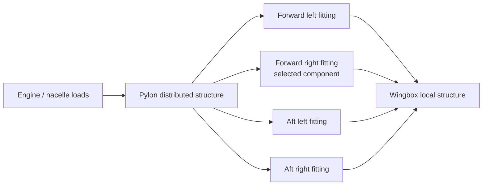

# Load Path and Free-Body Definition

## Coordinate system

- `+X`: forward
- `+Y`: aircraft right
- `+Z`: upward

All input forces are external loads acting on the isolated pylon/engine system. Reactions at the wingbox interfaces satisfy force and moment equilibrium.

## Representative architecture



## Resultant assembly

Each applied load is defined by a force `F`, an application point `r`, and an optional free moment `M0`. About reference `r0`:

```text
F_total = Σ F_i
M_total(r0) = Σ [M0_i + (r_i - r0) × F_i]
```

## Two-station load sharing

The forward station is at `x = 0`; the aft station is at `x = L`.

For vertical equilibrium:

```text
R_fz + R_az = -F_z
M_y - L R_az = 0
```

For lateral equilibrium:

```text
R_fy + R_ay = -F_y
M_z + L R_ay = 0
```

Axial reaction is split using an explicit forward share `ηx`; this is an assumption because statics alone cannot determine axial sharing. Roll moment is split by an explicit forward share and reacted as an equal/opposite vertical-force couple across the left/right fitting gauge.

The software reports residual force and moment. Residuals must be near numerical zero before a load case is accepted.

## Selected fitting

The selected component is the forward-right fitting by default. Its station force is divided by the number of parallel forward fittings, then augmented by the right-side roll-couple force. Changing the selected side changes only the sign of the roll-couple contribution.
